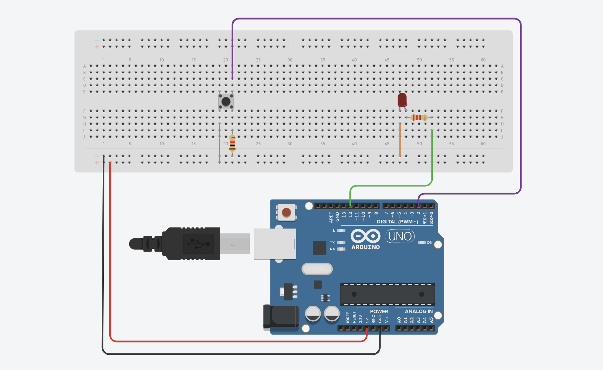

# Pushbutton Controlled LED - Arduino Project

This is a beginner-level Arduino project where an LED is controlled using a pushbutton. It’s a great way to learn about digital input and output on a microcontroller.

## 🔧 Components Used
- Arduino UNO
- Breadboard
- LED
- Pushbutton
- 220Ω Resistor (for LED)
- 10kΩ Resistor (for button pull-down)
- Jumper wires

## ⚙️ Circuit Diagram

## 💡 How It Works
The Arduino reads the state of the pushbutton. When the button is pressed (HIGH), it turns the LED on. When released (LOW), the LED turns off.

## 🧾 Arduino Code
The code is available in the file `Pushbutton_LED.ino` in this repository.

## 📹 Demo
(Optionally embed a demo GIF or link to a video)

## 🧠 What I Learned
- How to set up and read digital inputs
- Using pull-down resistors to prevent floating values
- Uploading and documenting Arduino projects on GitHub
